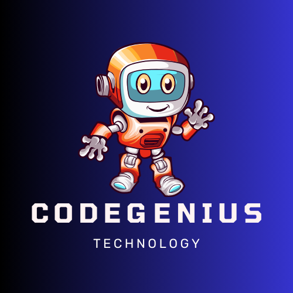

# cgenius


<p align="center">
 <a href="https://git.io/typing-svg"></a>

</p>


## Contributors

- [Zeenat Abrar](https://github.com/zeenatabrar)

- [Shubham Ratnakar Kulkarni](https://github.com/Shubham17121999)


<br>
Welcome to Code Genius, your AI-powered interview preparation platform. We are dedicated to helping students master the art of interviews through the magic of Artificial Intelligence and language processing.


### <h2 style="margin-top:100px ;"><i>👨🏻‍💻 Tech Stack & Languages used</i></h2>
- HTML, CSS, JavaScript
- React, Tailwind CSS, TypeScript
- Java, Spring Boot
- Git ,Github


### <h2><i>🚀 Libraries & Frameworks</i></h2>
<a href="" target="blank"></a>
<a href="" target="blank"></a>


## Landing Page
.png>)
## interview Page
.png>)

## about us Page
.png>)

## contact Page
.png>)


## API Root Endpoint

```
https://localhost:8080/
```

```
http://localhost:8888/swagger-ui/index.html
```


## Getting Started

1. Clone the repository using the command:
   ```
   https://github.com/zeenatabrar/cgenius
   ```

2. Compile and run the Java application to launch the console-based shopping platform.

## Deployed Link


## Contributions

We welcome contributions! Feel free to fork the repository, enhance functionalities, and submit pull requests.

## License

This project is licensed under the MIT License. Refer to the [LICENSE](LICENSE) file for detailed terms.

---

For any inquiries or feedback, contact us at [contact@codegenius.com](mailto:contact@codegenius.com). Embark on your prepartion journey with Sweet Honeydukes today!
Feel free to contribute and improve Code Genius! Happy coding! 🚀
